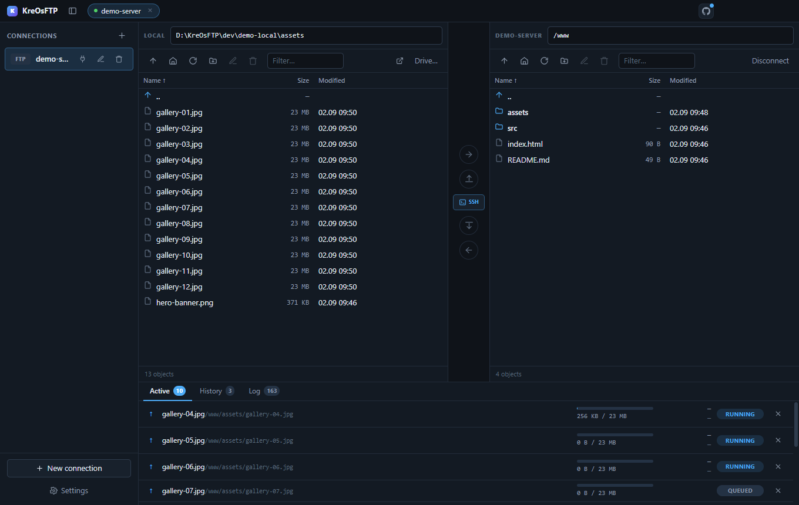
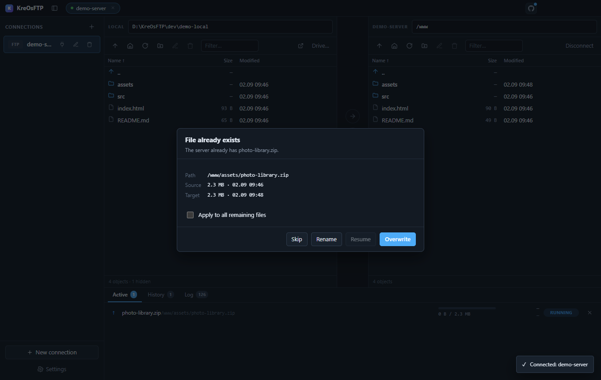
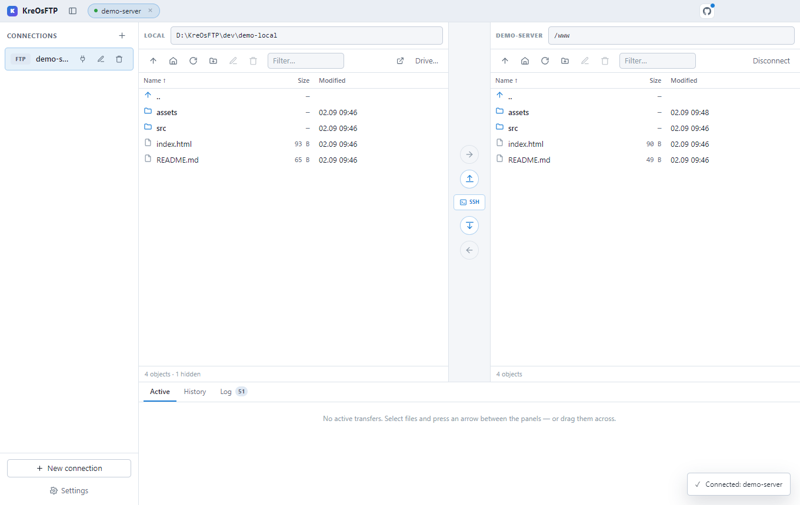

<div align="center">

# KreOsFTP

**A two-pane FTP / FTPS / SFTP client with an SSH terminal in the same window.**

Stop alternating between a file transfer app and a separate terminal.
Move files on the left, run commands on the right, in one place.

[](LICENSE)
[](#install)
[](https://electronjs.org)
[](https://www.typescriptlang.org)

English · [Русский](README.ru.md)



<sub>Two panes, a queue mid-transfer, and the SSH panel one click away.</sub>

</div>

---

## Why this exists

Every FTP client makes you leave it the moment you need a shell. Every SSH
client makes you leave it the moment you need to move a folder. The two tools
that solve both — WinSCP and MobaXterm — are Windows-only, and one of them is
proprietary.

KreOsFTP is the combination as open source, on all three platforms:

|                        | File panes | SSH terminal | Cross-platform | Open source |
| ---------------------- | :--------: | :----------: | :------------: | :---------: |
| FileZilla              |     ✅     |      ❌      |       ✅       |     ✅      |
| WinSCP                 |     ✅     |      ✅      |   Windows only |     ✅      |
| Cyberduck              |     ✅     |      ❌      |       ✅       |     ✅      |
| MobaXterm              |     ✅     |      ✅      |   Windows only |     ❌      |
| **KreOsFTP**           |   **✅**   |    **✅**    |     **✅**     |   **✅**    |

---

## Features

**Transfers**
- FTP, FTPS (explicit and implicit TLS) and SFTP over SSH
- Two-pane layout with drag & drop in both directions, files and whole folders
- Drop onto a folder row and it asks whether you meant *into* that folder
- Parallel transfers, each on its own connection
- Resume interrupted downloads and uploads from the byte where they stopped
- Overwrite rules: ask, always, skip, resume, or conditional on size and date
- Three resizable columns in both panes: name, size and modification date
- Open the local directory in the system file manager or a terminal

**Terminal**
- SSH terminal inside the server panel, on the same credentials as the transfer session
- Quick commands saved per server; add, edit or remove them from the terminal bar
- Copy and paste, resizable, survives panel layout changes
- A horizontally scrollable command strip whose copy/paste controls remain visible

**Sync**
- Preview before anything moves: what is queued, unchanged, and excluded
- `.ftpignore` support, read from either side
- Breadth-first comparison by presence, type and size, without downloading remote
  files for hashes; never deletes at the destination
- Hover a sync button to highlight included entries first and confirmed changes
  as the comparison progresses
- Styled confirmation before updating either side

**Automation**
- Configurable global shortcuts for reconnect, SSH, both sync directions and disconnect
- Macros made from connect, upload/download update, SSH command and disconnect steps
- A macro may have its own shortcut; conflicts are marked directly in the editor
- Every macro step runs strictly in order, appears as a notification and is written
  to the log
- Consecutive SSH steps share one shell, so `cd`, exported variables and activated
  environments carry over to the next command

**Everyday**
- Interface in English and Russian
- Dark and light themes, following the system by default
- Live protocol log — every command and reply, with passwords masked
- Settings split into General, Transfers, Shortcuts and Macros
- The last closed connection stays available for one-click reconnect and survives restarts
- Compact layouts remain usable in narrow windows
- Repository branch, commit and working-tree state are visible from the app
- Instant styled tooltips, including assigned shortcuts

---

## Sync rules — `.ftpignore`

Deployments almost never mean "copy everything". `node_modules`, `.git`, build
caches and local `.env` files have no business on a server, and re-uploading
them is how a two-second sync becomes a two-minute one.

Drop a `.ftpignore` in the sync root and both directions honour it. The syntax
is gitignore's, so there is nothing new to learn:

```gitignore
# Comments start with a hash
node_modules/          # trailing slash: directories only
*.log                  # any depth
/dist                  # leading slash: only at the sync root
build/**/*.map         # globs, including **
!important.log         # ! re-includes something an earlier rule excluded
\#not-a-comment        # backslash escapes a literal # or !
```

Three details worth knowing:

**Which file is read depends on the direction.** Updating the server reads the
*local* `.ftpignore`; pulling from the server reads the *remote* one. The side
you are copying *from* decides what leaves it — the same way `.gitignore`
governs the working tree it sits in.

**Excluded directories are never entered.** A matching folder is skipped whole
rather than walked and filtered, which is what keeps a preview over a tree
containing `node_modules` fast. This mirrors gitignore's own rule that a file
cannot be re-included while its parent stays excluded.

**`.ftpignore` itself is always excluded,** in every directory, and that rule
lives outside the user patterns — so even writing `!.ftpignore` cannot publish
your deployment rules by accident.

The preview always shows the count of excluded entries before anything moves,
so a rule that is too broad is visible rather than silent.

---

## More screenshots

<table>
<tr>
<td>
<br>
<b>Name conflicts.</b> Size and date of both sides, so the choice is informed.
“Resume” greys out when the sizes already match.
</td>
</tr>
<tr>
<td>
<br>
<b>Light theme.</b> Both themes are first-class; the default follows the system.
</td>
</tr>
</table>

---

## Android

The open-source mobile port lives in [`android`](android/README.md). Open that
folder directly in Android Studio or build it with the included Gradle wrapper.
It supports FTP, explicit FTPS, SFTP, an interactive SSH PTY terminal with
bindable hotkeys, two file panes, parallel transfers and size-based
`.ftpignore` synchronization.

Android-specific build, signing and security notes are documented in
[`android/README.md`](android/README.md) and
[`android/SECURITY.md`](android/SECURITY.md).

## Install

Download a build from [Releases](https://github.com/KreOWO/KreOsFTP/releases):

| Platform | File |
| --- | --- |
| Windows | `KreOsFTP-<version>-x64-setup.exe` |
| macOS | `KreOsFTP-<version>-arm64.dmg` (Apple silicon) or `-x64.dmg` (Intel) |
| Linux | `KreOsFTP-<version>-x86_64.AppImage` or the `.deb` |

> **Unsigned builds.** Releases are not code-signed yet, so Windows SmartScreen
> and macOS Gatekeeper will warn on first launch. Verify the checksum published
> with each release, or build from source — the instructions are below and take
> two commands.

---

## Build from source

Requires **Node.js 18+**.

```bash
git clone https://github.com/KreOWO/KreOsFTP.git
cd KreOsFTP
npm install
npm run dev
```

Packaging:

```bash
npm run dist         # Windows installer
npm run dist:mac     # macOS dmg + zip
npm run dist:linux   # AppImage, deb, tar.gz
```

Artifacts land in `release/`.

---

## Try it without a server

A local FTP server ships with the repo, so you can exercise every feature
against a real protocol without touching a production host.

```bash
pip install pyftpdlib
```

Then, in two terminals:

```bash
npm run test-server
```

```bash
npm run dev
```

It listens on `127.0.0.1:2121`, user `user`, password `12345`, serving
`dev/ftp-root/`. The credentials are deliberately trivial: the server binds to
loopback only and is meant to be thrown away.

---

## Security

Handling server credentials deserves more than a promise, so here is exactly
what happens to them.

- **Passwords are encrypted by the OS keystore** — DPAPI on Windows, Keychain on
  macOS, libsecret on Linux — through Electron's `safeStorage`. The ciphertext is
  bound to your OS account, so a copied `sites.json` is useless elsewhere.
- **If the keystore is unavailable, nothing is stored.** The app asks for the
  password each time rather than falling back to plaintext.
- **SSH host keys are pinned on first use.** A changed fingerprint aborts the
  connection with an explicit warning instead of a silent reconnect.
- **Secrets never reach the renderer.** It only ever learns whether a password
  exists, never its value.
- **Profiles, quick commands, shortcuts and macros are local application data.**
  They live in Electron's user-data `sites.json`, outside the repository. The
  repository ignores `sites.json` at every depth, along with `.env` files,
  private keys and private release keystores.
- **Macro and quick-command text is not encrypted.** Do not put passwords or
  tokens directly in a command; use server-side environment files or a secret
  manager instead.
- **`PASS` is masked in the log.**
- The renderer runs with `contextIsolation: true`, `nodeIntegration: false` and a
  strict Content-Security-Policy.

---

## Architecture

Network and filesystem access live only in the main process; the renderer has no
Node access at all.

```
src/
├── shared/       wire contract between the processes, i18n catalogs
├── main/
│   ├── session.ts        live connections + a per-session mutex
│   ├── queue.ts          transfer queue, resume, conflict rules
│   ├── sync.ts           directory comparison and .ftpignore
│   ├── store.ts          profiles, settings, macros, OS-encrypted secrets
│   ├── ssh-terminal.ts   interactive terminal + serial macro shell
│   └── protocols/        one file per protocol behind a shared interface
├── preload/      contextBridge → window.kreos
└── renderer/     React + TypeScript
```

Three decisions worth knowing about:

**One `Adapter` interface for every protocol.** The queue, the IPC layer and the
UI know nothing about FTP or SSH. Adding a protocol means adding one file under
`protocols/`.

**A mutex per session.** FTP is strictly one command at a time — two overlapping
`LIST` calls on one control socket desynchronise the connection and return
garbage. Every adapter call goes through `Session.run()`, which serialises them.

**Errors are not thrown across the IPC bridge.** Electron wraps a rejected
handler in an unreadable envelope, and the UI needs the server's own words
(`550 Permission denied`) intact. Main returns `{ ok, value }` / `{ ok, error }`
and the preload turns that back into an `Error`.

---

## Keyboard

| Key | Action |
| --- | --- |
| `↑` `↓` | move through the list |
| `Enter` | enter folder / transfer file |
| `Backspace` | go up one level |
| `Delete` | delete selection |
| `F2` | rename |
| `F5` | refresh both panes |
| `Ctrl+A` | select all |
| `Ctrl`+click | add to selection |
| `Shift`+click | select a range |
| `Ctrl+←` / `Ctrl+→` | switch Active / History / Log |
| `Ctrl+Shift+L` | connect to the last server |
| `Ctrl+Shift+T` | open or close SSH |
| `Ctrl+Shift+U` | update the server, with confirmation |
| `Ctrl+Shift+D` | update locally, with confirmation |
| `Ctrl+Shift+X` | disconnect |

The five application shortcuts are defaults, not hard-coded rules. Click a
shortcut field under **Settings → Shortcuts**, then hold modifiers and press the
final key. A conflicting assignment turns red and identifies its current owner.
Macro shortcuts are configured in the same way.

---

## Known limitations

These are honest consequences of the underlying libraries, not oversights.

- **No active-mode FTP.** `basic-ftp` is passive-only, so there is no switch for
  a mode that would not work. Passive mode is what survives NAT anyway.
- **Cancelling a running transfer takes effect after the current file.** Neither
  `basic-ftp` nor `ssh2` can abort mid-file without tearing down the connection.
  Queued files cancel instantly.
- **Version sync intentionally compares sizes, not file hashes.** Equal-size
  edits are treated as unchanged so a remote preview never has to download every
  file. Use a normal transfer when byte-for-byte verification is required.
- **Macro SSH commands are non-interactive.** Commands that require a prompt
  should be changed to a non-interactive form; the built-in terminal remains
  available for interactive work.

---

## Contributing

Issues and pull requests are welcome. Before opening a PR:

```bash
npm run typecheck
npm run i18n:check
npm run build
```

`i18n:check` compares every string passed to `t()` against the English catalog
and fails on anything untranslated — a missing entry is otherwise silent,
showing Russian to an English user.

New user-facing text goes through `t('Русский текст')`; the Russian source is
the catalog key, so only `src/shared/i18n.en.ts` needs a new entry.

---

## License

[MIT](LICENSE) © KreO
