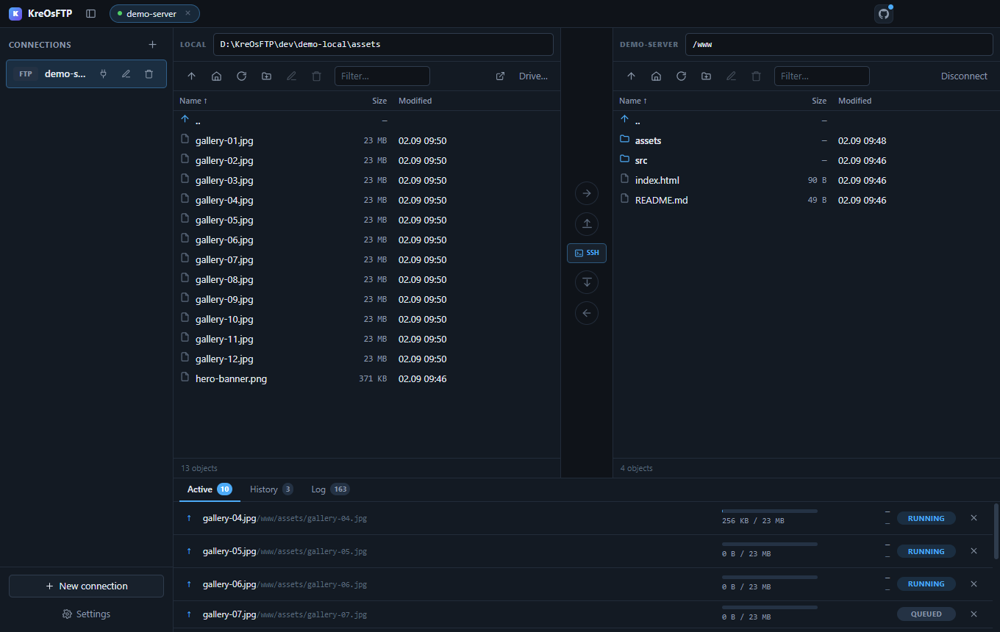
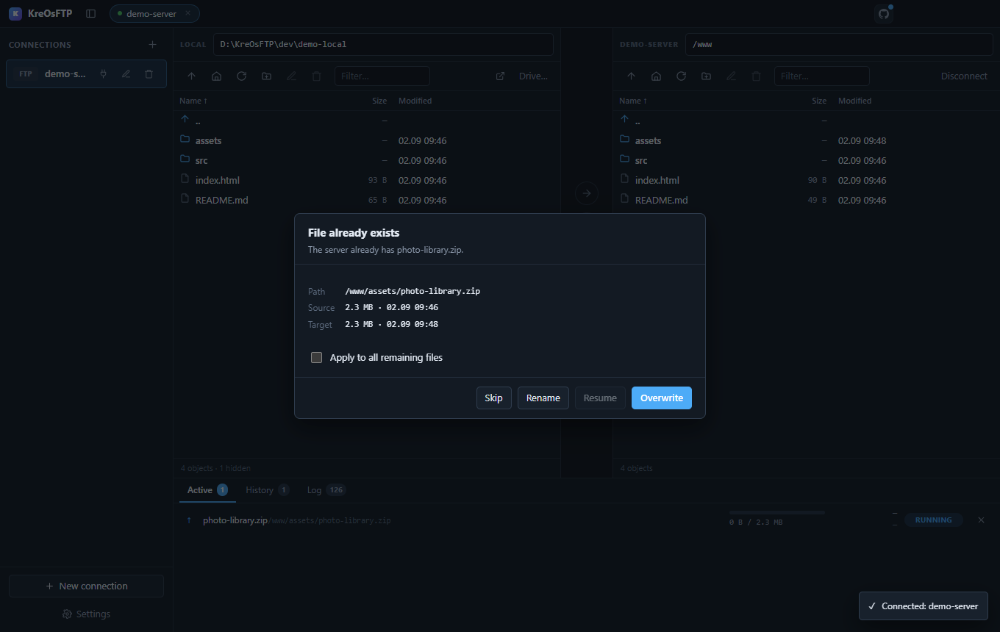
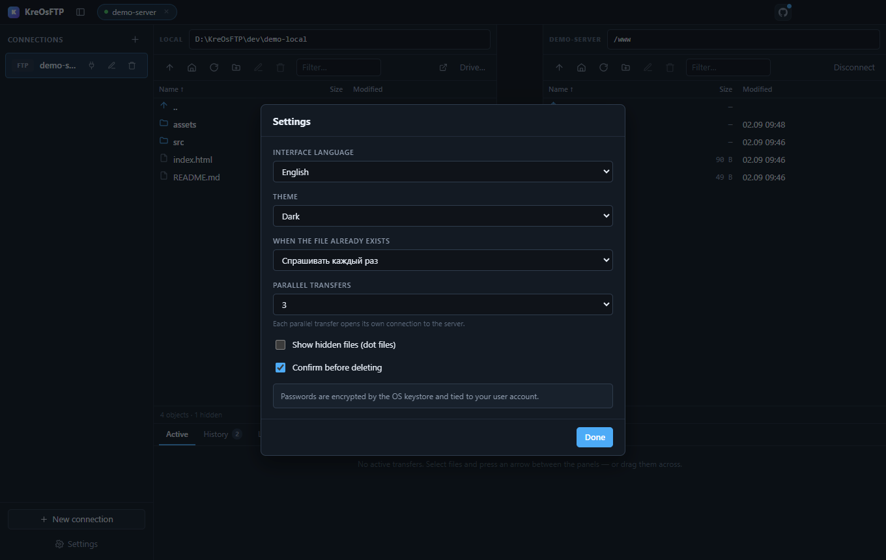
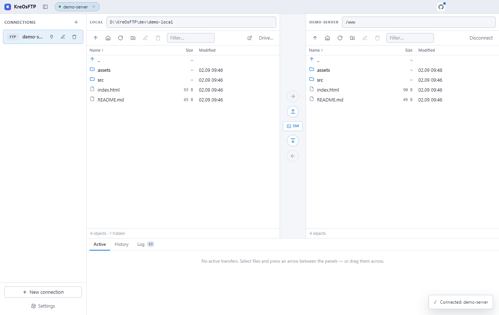

<div align="center">

# KreOsFTP

**Двухпанельный клиент FTP / FTPS / SFTP с SSH-терминалом в том же окне.**

Больше не нужно переключаться между программой передачи файлов и отдельным
терминалом. Слева файлы, справа команды — в одном месте.

[](LICENSE)
[](#установка)
[](https://electronjs.org)
[](https://www.typescriptlang.org)

[English](README.md) · Русский



<sub>Две панели, очередь в работе и SSH-панель в одном клике.</sub>

</div>

---

## Зачем это нужно

Любой FTP-клиент заставляет выйти из него, как только понадобилась консоль.
Любой SSH-клиент заставляет выйти из него, как только понадобилось перенести
папку. Две программы, которые закрывают и то, и другое — WinSCP и MobaXterm —
работают только под Windows, и одна из них проприетарная.

KreOsFTP — эта комбинация с открытым кодом и на всех трёх платформах:

|                        | Файловые панели | SSH-консоль | Кроссплатформенность | Открытый код |
| ---------------------- | :-------------: | :---------: | :------------------: | :----------: |
| FileZilla              |       ✅        |     ❌      |          ✅          |      ✅      |
| WinSCP                 |       ✅        |     ✅      |    только Windows    |      ✅      |
| Cyberduck              |       ✅        |     ❌      |          ✅          |      ✅      |
| MobaXterm              |       ✅        |     ✅      |    только Windows    |      ❌      |
| **KreOsFTP**           |     **✅**      |   **✅**    |        **✅**        |    **✅**    |

---

## Возможности

**Передача**
- FTP, FTPS (явный и неявный TLS) и SFTP поверх SSH
- Две панели с перетаскиванием в обе стороны — файлы и папки целиком
- Бросок на строку-папку спрашивает, класть ли **внутрь** неё
- Параллельные передачи, каждая на своём соединении
- Докачка прерванных передач с того байта, где всё остановилось
- Правила перезаписи: спрашивать, всегда, пропускать, докачивать, а также по
  размеру и дате

**Терминал**
- SSH-консоль внутри серверной панели, на тех же учётных данных
- Быстрые команды, сохраняемые для каждого сервера, с изменением порядка
- Копирование и вставка, изменение высоты, переживает перестройку панелей

**Синхронизация**
- Предпросмотр до того, как что-либо тронуто: что в очередь, что без изменений,
  что исключено
- Поддержка `.ftpignore` с любой из сторон
- Сравнение по наличию, типу и размеру; в назначении ничего не удаляется

**Повседневное**
- Интерфейс на русском и английском
- Тёмная и светлая темы, по умолчанию как в системе
- Живой журнал протокола — все команды и ответы, пароли замаскированы
- Управление с клавиатуры

---

## Правила синхронизации — `.ftpignore`

Выкладка почти никогда не означает «скопировать всё». `node_modules`, `.git`,
кэши сборки и локальные `.env` на сервере не нужны, а их повторная заливка —
верный способ превратить двухсекундную синхронизацию в двухминутную.

Положите `.ftpignore` в корень синхронизации, и оба направления его учтут.
Синтаксис — гитигнорный, учить нечего:

```gitignore
# Комментарий начинается с решётки
node_modules/          # слэш в конце: только каталоги
*.log                  # на любой глубине
/dist                  # слэш в начале: только в корне синхронизации
build/**/*.map         # шаблоны, включая **
!important.log         # ! возвращает то, что исключило правило выше
\#не-комментарий       # обратный слэш экранирует буквальные # и !
```

Три детали, о которых стоит знать:

**Какой файл читается, зависит от направления.** При обновлении сервера берётся
*локальный* `.ftpignore`, при получении с сервера — *серверный*. Что покидает
сторону, решает сама эта сторона — ровно как `.gitignore` управляет тем рабочим
каталогом, в котором лежит.

**В исключённые каталоги никто не заходит.** Совпавшая папка пропускается
целиком, а не обходится с фильтрацией — благодаря этому предпросмотр по дереву
с `node_modules` остаётся быстрым. Так же ведёт себя и сам gitignore: файл
нельзя вернуть, пока исключён его родитель.

**Сам `.ftpignore` исключён всегда,** в любом каталоге, и это правило живёт вне
пользовательских — поэтому даже строка `!.ftpignore` не выложит ваши правила
выкладки наружу.

Предпросмотр всегда показывает число исключённых объектов до того, как что-либо
тронуто, — слишком широкое правило видно сразу, а не постфактум.

---

## Ещё скриншоты

<table>
<tr>
<td width="50%">
<br>
<b>Конфликты имён.</b> Размер и дата обеих сторон — выбор осознанный.
«Докачать» гаснет, когда размеры уже совпали.
</td>
<td width="50%">
<br>
<b>Настройки.</b> Язык интерфейса, тема и поведение при совпадении имён —
включая условные правила.
</td>
</tr>
<tr>
<td colspan="2">
<br>
<b>Светлая тема.</b> Обе темы полноценные, по умолчанию — как в системе.
</td>
</tr>
</table>

---

## Установка

Скачайте сборку со страницы [Releases](https://github.com/KreOWO/KreOsFTP/releases):

| Платформа | Файл |
| --- | --- |
| Windows | `KreOsFTP-<версия>-x64-setup.exe` |
| macOS | `KreOsFTP-<версия>-arm64.dmg` (Apple silicon) или `-x64.dmg` (Intel) |
| Linux | `KreOsFTP-<версия>-x86_64.AppImage` либо `.deb` |

> **Сборки без подписи.** Релизы пока не подписаны, поэтому SmartScreen в Windows
> и Gatekeeper в macOS предупредят при первом запуске. Сверьте контрольную сумму
> из релиза или соберите из исходников — это две команды, они ниже.

---

## Сборка из исходников

Нужен **Node.js 18+**.

```bash
git clone https://github.com/KreOWO/KreOsFTP.git
cd KreOsFTP
npm install
npm run dev
```

Упаковка:

```bash
npm run dist         # установщик для Windows
npm run dist:mac     # dmg и zip для macOS
npm run dist:linux   # AppImage, deb, tar.gz
```

Готовые файлы появятся в `release/`.

---

## Проверка без настоящего сервера

В репозитории есть локальный FTP-сервер — можно опробовать любую возможность на
настоящем протоколе, не трогая боевой хост.

```bash
pip install pyftpdlib
```

Затем в двух терминалах:

```bash
npm run test-server
```

```bash
npm run dev
```

Он слушает `127.0.0.1:2121`, логин `user`, пароль `12345`, отдаёт
`dev/ftp-root/`. Учётные данные намеренно тривиальны: сервер слушает только
петлевой интерфейс и создаётся одноразово.

---

## Безопасность

Работа с чужими паролями заслуживает не обещаний, а описания. Вот что с ними
происходит.

- **Пароли шифруются хранилищем ОС** — DPAPI в Windows, Keychain в macOS,
  libsecret в Linux — через `safeStorage` из Electron. Шифротекст привязан к
  учётной записи ОС, поэтому скопированный `sites.json` на другой машине
  бесполезен.
- **Если хранилище недоступно, ничего не сохраняется.** Программа спросит пароль
  заново, а не запишет его открытым текстом.
- **Ключ SSH-хоста закрепляется при первом подключении.** Изменившийся отпечаток
  разрывает соединение с явным предупреждением, а не переподключается молча.
- **Секреты не попадают в рендерер.** Он знает лишь факт наличия пароля, но не
  его значение.
- **`PASS` в журнале маскируется.**
- Рендерер работает с `contextIsolation: true`, `nodeIntegration: false` и
  строгой Content-Security-Policy.

---

## Архитектура

Сеть и файловая система живут только в главном процессе; у рендерера доступа к
Node нет вовсе.

```
src/
├── shared/       контракт между процессами, каталоги переводов
├── main/
│   ├── session.ts        живые соединения + мьютекс на сессию
│   ├── queue.ts          очередь передач, докачка, правила конфликтов
│   ├── sync.ts           сравнение каталогов и .ftpignore
│   ├── store.ts          профили, секреты под шифрованием ОС
│   ├── ssh-terminal.ts   интерактивные shell-каналы
│   └── protocols/        по файлу на протокол за общим интерфейсом
├── preload/      contextBridge → window.kreos
└── renderer/     React + TypeScript
```

Три решения, о которых стоит знать:

**Один интерфейс `Adapter` на все протоколы.** Очередь, слой IPC и интерфейс
ничего не знают про FTP и SSH. Добавить протокол — значит добавить один файл в
`protocols/`.

**Мьютекс на сессию.** FTP строго однокомандный: два параллельных `LIST` на одном
управляющем сокете рассинхронизируют соединение и вернут мусор. Все обращения к
адаптеру проходят через `Session.run()`, которая выстраивает их в цепочку.

**Ошибки не бросаются через мост IPC.** Electron заворачивает отклонённый вызов в
нечитаемую обёртку, а интерфейсу нужна формулировка сервера дословно
(`550 Permission denied`). Главный процесс возвращает `{ ok, value }` /
`{ ok, error }`, а preload превращает это обратно в `Error`.

---

## Горячие клавиши

| Клавиша | Действие |
| --- | --- |
| `↑` `↓` | перемещение по списку |
| `Enter` | войти в папку / передать файл |
| `Backspace` | на уровень вверх |
| `Delete` | удалить выделенное |
| `F2` | переименовать |
| `F5` | обновить обе панели |
| `Ctrl+A` | выделить всё |
| `Ctrl`+клик | добавить к выделению |
| `Shift`+клик | выделить диапазон |

---

## Известные ограничения

Это честные следствия используемых библиотек, а не недосмотр.

- **Активный режим FTP не поддерживается.** `basic-ftp` работает только в
  пассивном, поэтому переключателя для неработающего режима нет. Через NAT
  проходит всё равно только пассивный.
- **Отмена активной передачи срабатывает по завершении текущего файла.** Ни
  `basic-ftp`, ни `ssh2` не умеют прервать передачу на середине, не разрывая
  соединение. Файлы в очереди отменяются мгновенно.
- **Колонка прав пуста на многих FTP-серверах.** Современные серверы отвечают на
  листинг командой `MLSD`, обязательные факты которой — только тип, размер и
  дата. Показывается прочерк, а не выдуманное значение. По SFTP права есть
  всегда.

---

## Участие в разработке

Issues и pull request'ы приветствуются. Перед отправкой PR:

```bash
npm run typecheck
npm run i18n:check
```

`i18n:check` сверяет каждую строку, переданную в `t()`, с английским каталогом и
падает на непереведённой — иначе пропуск остаётся незаметным и англоязычный
пользователь увидит русский текст.

Новый текст интерфейса оформляется как `t('Русский текст')`; русский источник и
есть ключ каталога, поэтому запись нужна только в `src/shared/i18n.en.ts`.

---

## Лицензия

[MIT](LICENSE) © KreO
