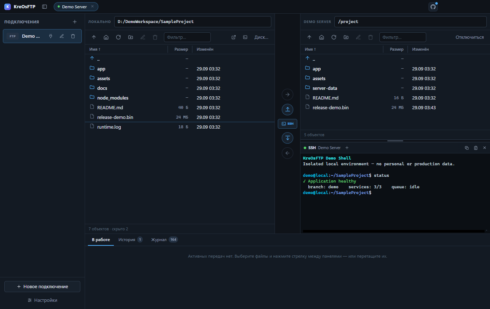
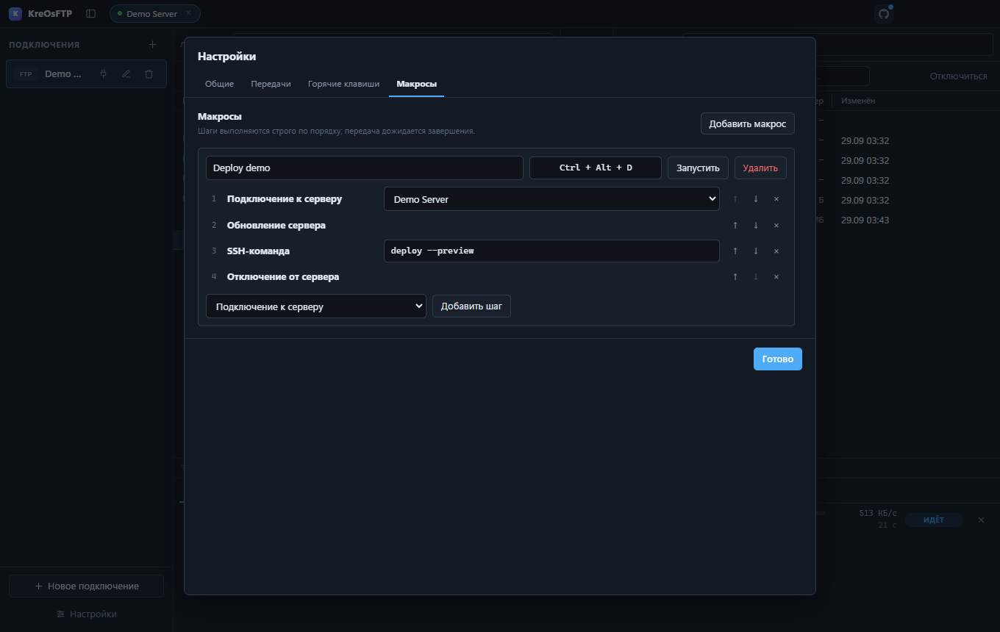
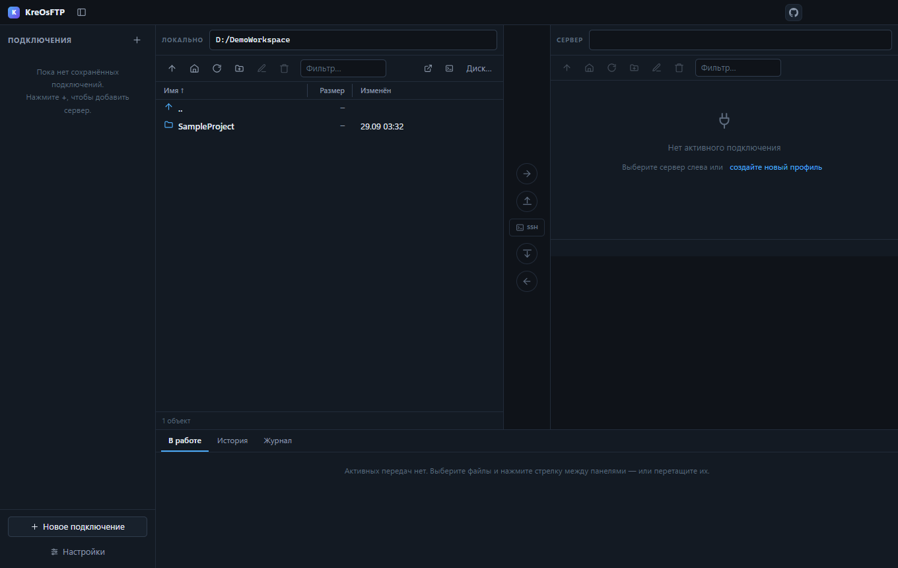
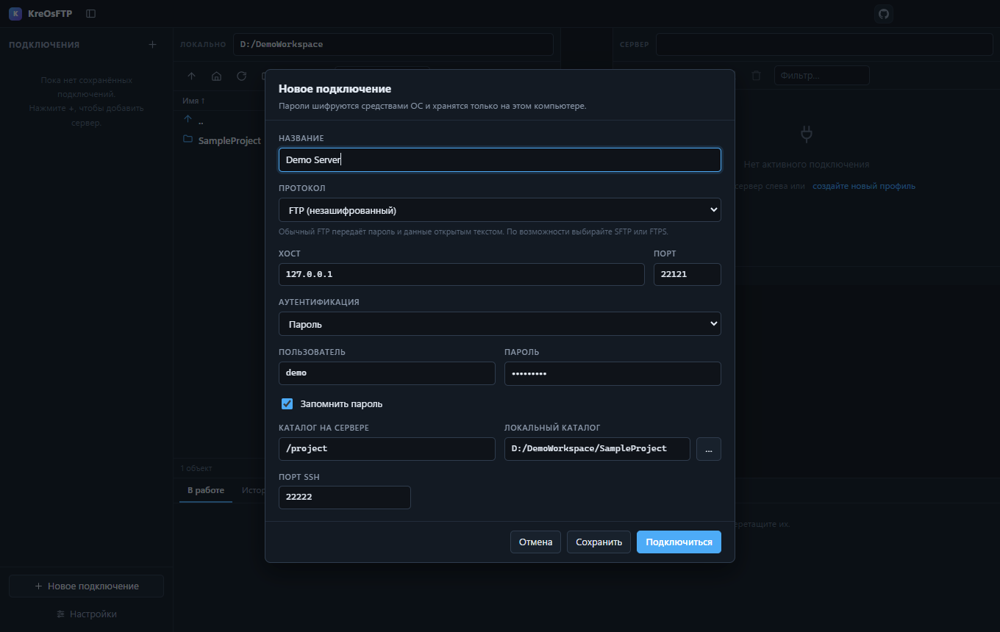
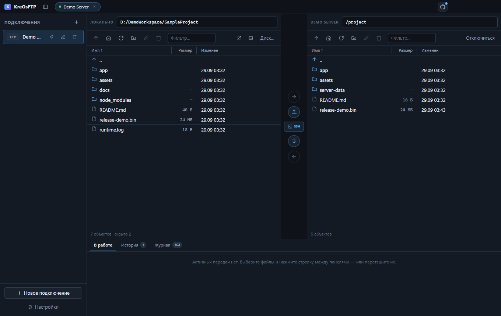
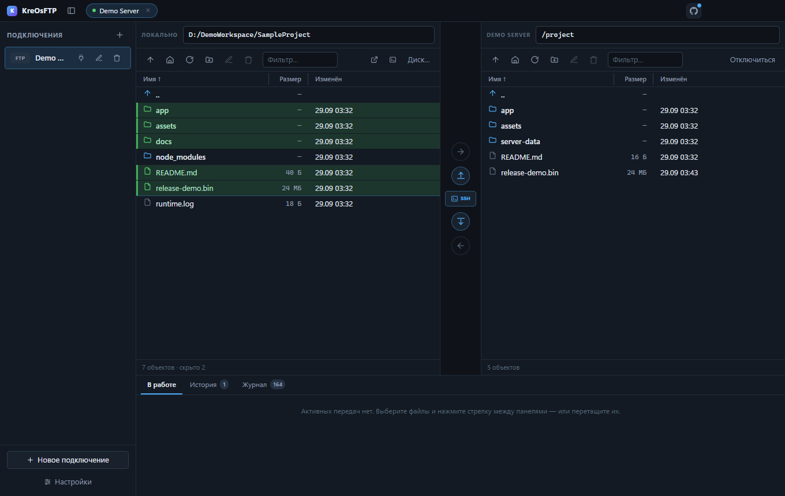
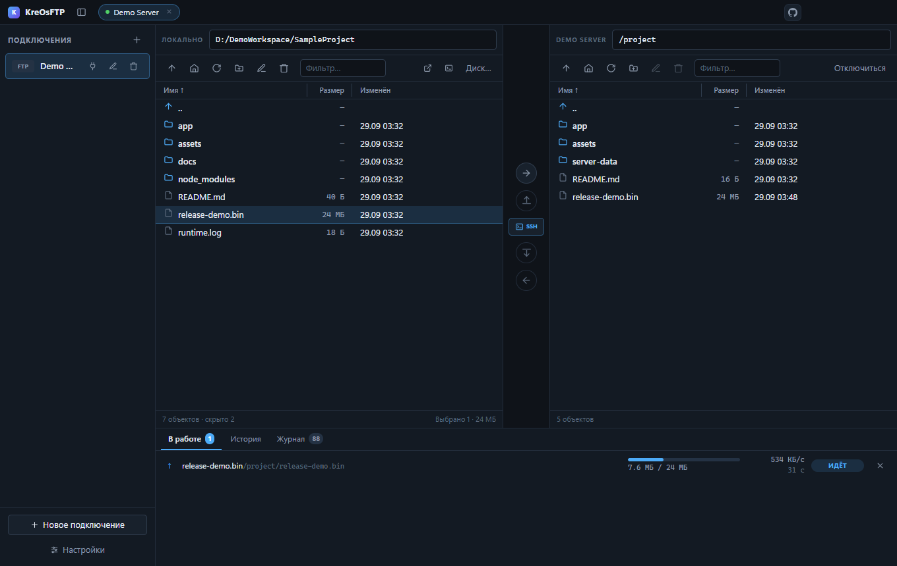
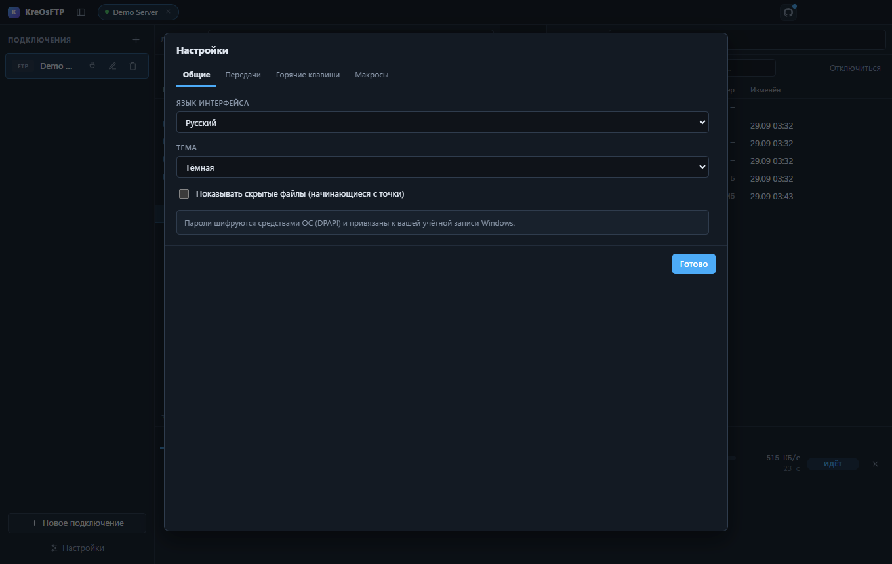
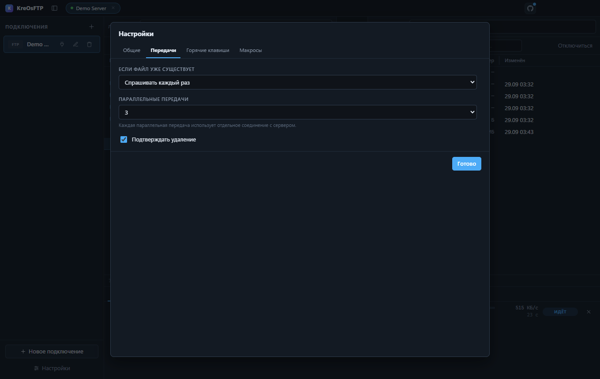
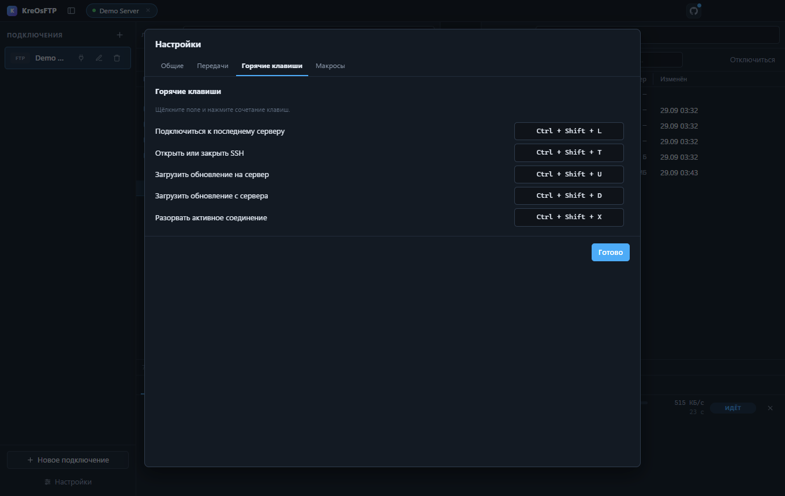

<div align="center">

# KreOsFTP

**Файлы, SSH и автоматизация — в одном окне.**

Работайте с локальными и серверными файлами в двух панелях, открывайте SSH рядом
с серверным проводником и собирайте повторяющиеся действия в макросы. Обычную
выкладку можно выполнить одним хоткеем: подключиться, синхронизировать файлы,
запустить команды на сервере и отключиться.

[](LICENSE)
[](#установка)
[](https://electronjs.org)
[](https://www.typescriptlang.org)

[English](README.md) · Русский



<sub>Локальные файлы, сервер и полноценный SSH-терминал остаются перед глазами.</sub>

</div>

---

## Один хоткей вместо рутины

Обычная выкладка состоит из одних и тех же шагов: подключиться к серверу,
отправить изменившиеся файлы, выполнить команду перезапуска и закрыть соединение.
В KreOsFTP эту последовательность можно сохранить как макрос и назначить ей
любое свободное сочетание клавиш.

Например, макрос для выкладки может:

1. подключиться к выбранному серверу;
2. обновить сервер с учётом `.ftpignore`;
3. выполнить `docker compose up -d` или другую SSH-команду;
4. отключиться после успешного завершения.

Шаги запускаются строго по очереди. Передача файлов обязательно завершается до
следующей команды, а каждый этап появляется в уведомлениях и журнале. В итоге
вся рутинная операция запускается одним хоткеем, но остаётся прозрачной и
проверяемой.



## Зачем нужен ещё один FTP-клиент

Файловый клиент и терминал обычно живут в разных окнах. При каждой выкладке
приходится переключаться между ними, повторно искать нужный сервер и следить за
порядком действий вручную. KreOsFTP объединяет эти задачи и при этом остаётся
открытым и кроссплатформенным:

|                        | Файловые панели | SSH-консоль | Кроссплатформенность | Открытый код |
| ---------------------- | :-------------: | :---------: | :------------------: | :----------: |
| FileZilla              |       ✅        |     ❌      |          ✅          |      ✅      |
| WinSCP                 |       ✅        |     ✅      |    только Windows    |      ✅      |
| Cyberduck              |       ✅        |     ❌      |          ✅          |      ✅      |
| MobaXterm              |       ✅        |     ✅      |    только Windows    |      ❌      |
| **KreOsFTP**           |     **✅**      |   **✅**    |        **✅**        |    **✅**    |

---

## Возможности

### Работа с файлами

- FTP, FTPS (явный и неявный TLS) и SFTP поверх SSH
- Две панели с перетаскиванием в обе стороны — файлы и папки целиком
- При перетаскивании на папку приложение уточняет, нужно ли положить файлы внутрь
- Параллельные передачи, каждая на своём соединении
- Продолжение прерванной передачи с последнего полученного байта
- Правила перезаписи: спрашивать, всегда, пропускать, докачивать, а также по
  размеру и дате
- Три настраиваемые по ширине колонки: имя, размер и дата изменения
- Открытие локальной папки в системном проводнике или терминале

### SSH-терминал

- Полноценный интерактивный терминал внутри серверной панели
- Для входа используются данные текущего подключения и отдельный SSH-порт
- Быстрые команды сохраняются отдельно для каждого сервера; их можно добавлять,
  редактировать и удалять
- Поддерживаются копирование, вставка и изменение высоты терминала
- Строка быстрых команд прокручивается по горизонтали, а кнопки копирования и
  вставки всегда остаются доступными

### Синхронизация версий

- Предпросмотр до начала передачи: сразу видно, какие файлы разрешены правилами,
  какие изменились и какие исключены
- Поддержка `.ftpignore` с любой из сторон
- Обход в ширину и сравнение по наличию, типу и размеру без скачивания файлов
  сервера ради хешей; в назначении ничего не удаляется
- При наведении на кнопку синхронизации сначала подсвечиваются разрешённые
  элементы, затем подтверждённые отличия
- Стилизованное подтверждение перед обновлением любой стороны

### Хоткеи и макросы

- Настраиваемые хоткеи переподключения, SSH, синхронизации в обе стороны и
  разрыва соединения
- Макросы из шагов подключения, обновления сервера или локальной папки,
  SSH-команд и отключения
- Любому макросу можно назначить свой хоткей; конфликт сразу отмечается в
  редакторе и показывает, где сочетание уже занято
- Каждый шаг выполняется строго последовательно, показывается уведомлением и
  записывается в журнал
- Последовательные SSH-команды используют одну shell-сессию: `cd`, переменные и
  активированное окружение сохраняются для следующей команды

### Интерфейс

- Интерфейс на русском и английском
- Тёмная и светлая темы, по умолчанию как в системе
- Живой журнал протокола со всеми командами и ответами; пароли маскируются
- Настройки разделены на «Общие», «Передачи», «Горячие клавиши» и «Макросы»
- Последнее закрытое соединение доступно для быстрого переподключения и
  запоминается между запусками
- Интерфейс остаётся рабочим при сильном сужении окна
- В приложении показываются ветка, коммит и состояние Git-репозитория
- Мгновенные стилизованные подсказки, включая назначенные хоткеи

---

## Правила синхронизации — `.ftpignore`

Выкладка почти никогда не означает «скопировать всё». `node_modules`, `.git`,
кэши сборки и локальные `.env` на сервере не нужны, а их повторная заливка —
верный способ превратить двухсекундную синхронизацию в двухминутную.

Положите `.ftpignore` в корень синхронизации — приложение учтёт его в обоих
направлениях. Формат совместим с `.gitignore`, поэтому привычные правила можно
использовать без изменений:

```gitignore
# Комментарий начинается с решётки
node_modules/          # слэш в конце: только каталоги
*.log                  # на любой глубине
/dist                  # слэш в начале: только в корне синхронизации
build/**/*.map         # шаблоны, включая **
!important.log         # ! возвращает то, что исключило правило выше
\#не-комментарий       # обратный слэш экранирует буквальные # и !
```

Три детали, о которых стоит знать:

**Источник правил зависит от направления.** При обновлении сервера читается
*локальный* `.ftpignore`, а при получении файлов — *серверный*. Иными словами,
правила всегда берутся с той стороны, откуда копируются данные.

**Исключённые каталоги не обходятся.** Совпавшая папка пропускается целиком,
поэтому даже большое дерево с `node_modules` не замедляет предпросмотр. Как и в
`.gitignore`, нельзя вернуть отдельный файл, пока исключён его родительский
каталог.

**Сам `.ftpignore` исключён всегда,** в любом каталоге, и это правило живёт вне
пользовательских — поэтому даже строка `!.ftpignore` не выложит ваши правила
выкладки наружу.

До начала передачи предпросмотр показывает, что именно попадёт в очередь. Если
правило оказалось слишком широким, это будет видно до подтверждения операции.

---

## Как выглядит приложение

<table>
<tr>
<td width="50%">
<br>
<b>Чистый старт.</b> Можно сразу работать с локальными файлами или добавить сервер.
</td>
<td width="50%">
<br>
<b>Новое подключение.</b> FTP, FTPS и SFTP с отдельным портом для SSH.
</td>
</tr>
<tr>
<td width="50%">
<br>
<b>Две файловые панели.</b> Локальный каталог и сервер видны одновременно.
</td>
<td width="50%">
<br>
<b>SSH рядом с файлами.</b> Терминал открывается внутри серверной части окна.
</td>
</tr>
<tr>
<td width="50%">
<br>
<b>Предпросмотр <code>.ftpignore</code>.</b> Зелёным отмечены найденные изменения; исключённые файлы не подсвечиваются.
</td>
<td width="50%">
<br>
<b>Передача в работе.</b> Видны прогресс, скорость и оставшийся объём.
</td>
</tr>
</table>

### Настройки

<table>
<tr>
<td width="50%"><br><b>Общие</b> — язык, тема и скрытые файлы.</td>
<td width="50%"><br><b>Передачи</b> — конфликты, параллельность и подтверждения.</td>
</tr>
<tr>
<td width="50%"><br><b>Горячие клавиши</b> — основные действия приложения.</td>
<td width="50%"><br><b>Макросы</b> — последовательности действий, запускаемые одним хоткеем.</td>
</tr>
</table>

---

## Android

Открытый мобильный порт находится в папке [`android`](android/README.md). Её
можно открыть напрямую в Android Studio или собрать приложенным Gradle wrapper.
Поддерживаются FTP, явный FTPS, SFTP, интерактивный SSH PTY-терминал с
настраиваемыми хоткеями, две файловые панели, параллельные передачи и
синхронизация по размеру с учётом `.ftpignore`.

Сборка, подпись и особенности безопасности Android описаны в
[`android/README.md`](android/README.md) и
[`android/SECURITY.md`](android/SECURITY.md).

## Установка

Скачайте сборку со страницы [Releases](https://github.com/KreOWO/KreOsFTP/releases):

| Платформа | Файл |
| --- | --- |
| Windows | `KreOsFTP-<версия>-x64-setup.exe` |
| macOS | `KreOsFTP-<версия>-arm64.dmg` (Apple silicon) или `-x64.dmg` (Intel) |
| Linux | `KreOsFTP-<версия>-x86_64.AppImage` либо `.deb` |

> **Сборки без подписи.** Релизы пока не подписаны, поэтому SmartScreen в Windows
> и Gatekeeper в macOS предупредят при первом запуске. Сверьте контрольную сумму
> из релиза или соберите из исходников — это две команды, они ниже.

---

## Сборка из исходников

Нужен **Node.js 18+**.

```bash
git clone https://github.com/KreOWO/KreOsFTP.git
cd KreOsFTP
npm install
npm run dev
```

Упаковка:

```bash
npm run dist         # установщик для Windows
npm run dist:mac     # dmg и zip для macOS
npm run dist:linux   # AppImage, deb, tar.gz
```

Готовые файлы появятся в `release/`.

---

## Проверка без настоящего сервера

В репозитории есть локальный FTP-сервер — можно опробовать любую возможность на
настоящем протоколе, не трогая боевой хост.

```bash
pip install pyftpdlib
```

Затем в двух терминалах:

```bash
npm run test-server
```

```bash
npm run dev
```

Он слушает `127.0.0.1:2121`, логин `user`, пароль `12345`, отдаёт
`dev/ftp-root/`. Учётные данные намеренно тривиальны: сервер слушает только
петлевой интерфейс и создаётся одноразово.

---

## Безопасность

Работа с чужими паролями заслуживает не обещаний, а описания. Вот что с ними
происходит.

- **Пароли шифруются хранилищем ОС** — DPAPI в Windows, Keychain в macOS,
  libsecret в Linux — через `safeStorage` из Electron. Шифротекст привязан к
  учётной записи ОС, поэтому скопированный `sites.json` на другой машине
  бесполезен.
- **Если хранилище недоступно, ничего не сохраняется.** Программа спросит пароль
  заново, а не запишет его открытым текстом.
- **Ключ SSH-хоста закрепляется при первом подключении.** Изменившийся отпечаток
  разрывает соединение с явным предупреждением, а не переподключается молча.
- **Секреты не попадают в рендерер.** Он знает лишь факт наличия пароля, но не
  его значение.
- **Профили, быстрые команды, хоткеи и макросы — локальные данные приложения.**
  Они находятся в пользовательском `sites.json` Electron вне репозитория.
  Репозиторий игнорирует `sites.json` на любой глубине, а также `.env`, приватные
  ключи и закрытые release-keystore.
- **Текст макросов и быстрых команд не шифруется.** Не вставляйте в команды
  пароли и токены; используйте серверные файлы окружения или менеджер секретов.
- **`PASS` в журнале маскируется.**
- Рендерер работает с `contextIsolation: true`, `nodeIntegration: false` и
  строгой Content-Security-Policy.

---

## Архитектура

Сеть и файловая система живут только в главном процессе; у рендерера доступа к
Node нет вовсе.

```
src/
├── shared/       контракт между процессами, каталоги переводов
├── main/
│   ├── session.ts        живые соединения + мьютекс на сессию
│   ├── queue.ts          очередь передач, докачка, правила конфликтов
│   ├── sync.ts           сравнение каталогов и .ftpignore
│   ├── store.ts          профили, настройки, макросы, шифрованные секреты
│   ├── ssh-terminal.ts   терминал + последовательная shell макросов
│   └── protocols/        по файлу на протокол за общим интерфейсом
├── preload/      contextBridge → window.kreos
└── renderer/     React + TypeScript
```

Три решения, о которых стоит знать:

**Один интерфейс `Adapter` на все протоколы.** Очередь, слой IPC и интерфейс
ничего не знают про FTP и SSH. Добавить протокол — значит добавить один файл в
`protocols/`.

**Мьютекс на сессию.** FTP строго однокомандный: два параллельных `LIST` на одном
управляющем сокете рассинхронизируют соединение и вернут мусор. Все обращения к
адаптеру проходят через `Session.run()`, которая выстраивает их в цепочку.

**Ошибки не бросаются через мост IPC.** Electron заворачивает отклонённый вызов в
нечитаемую обёртку, а интерфейсу нужна формулировка сервера дословно
(`550 Permission denied`). Главный процесс возвращает `{ ok, value }` /
`{ ok, error }`, а preload превращает это обратно в `Error`.

---

## Горячие клавиши

| Клавиша | Действие |
| --- | --- |
| `↑` `↓` | перемещение по списку |
| `Enter` | войти в папку / передать файл |
| `Backspace` | на уровень вверх |
| `Delete` | удалить выделенное |
| `F2` | переименовать |
| `F5` | обновить обе панели |
| `Ctrl+A` | выделить всё |
| `Ctrl`+клик | добавить к выделению |
| `Shift`+клик | выделить диапазон |
| `Ctrl+←` / `Ctrl+→` | переключить «В работе» / «История» / «Журнал» |
| `Ctrl+Shift+L` | подключиться к последнему серверу |
| `Ctrl+Shift+T` | открыть или закрыть SSH |
| `Ctrl+Shift+U` | обновить сервер с подтверждением |
| `Ctrl+Shift+D` | обновить локальную папку с подтверждением |
| `Ctrl+Shift+X` | разорвать соединение |

Пять хоткеев приложения — значения по умолчанию, а не жёсткие правила.
Кликните поле в **Настройки → Горячие клавиши**, удерживайте модификаторы и
нажмите финальную клавишу. Конфликтующее назначение покраснеет и покажет, где
сочетание уже используется. Хоткеи макросов задаются так же.

---

## Известные ограничения

Это честные следствия используемых библиотек, а не недосмотр.

- **Активный режим FTP не поддерживается.** `basic-ftp` работает только в
  пассивном, поэтому переключателя для неработающего режима нет. Через NAT
  проходит всё равно только пассивный.
- **Отмена активной передачи срабатывает по завершении текущего файла.** Ни
  `basic-ftp`, ни `ssh2` не умеют прервать передачу на середине, не разрывая
  соединение. Файлы в очереди отменяются мгновенно.
- **Синхронизация версий намеренно сравнивает размеры, а не хеши.** Изменение,
  не поменявшее размер файла, считается совпадением — зато предпросмотру не
  приходится скачивать каждый серверный файл. Для побайтовой проверки
  используйте обычную передачу.
- **SSH-команды макроса неинтерактивны.** Команду, требующую ввода, следует
  перевести в неинтерактивный режим; для ручной работы остаётся встроенный
  терминал.

---

## Участие в разработке

Issues и pull request'ы приветствуются. Перед отправкой PR:

```bash
npm run typecheck
npm run i18n:check
npm run build
```

`i18n:check` сверяет каждую строку, переданную в `t()`, с английским каталогом и
падает на непереведённой — иначе пропуск остаётся незаметным и англоязычный
пользователь увидит русский текст.

Новый текст интерфейса оформляется как `t('Русский текст')`; русский источник и
есть ключ каталога, поэтому запись нужна только в `src/shared/i18n.en.ts`.

---

## Лицензия

[MIT](LICENSE) © KreO
